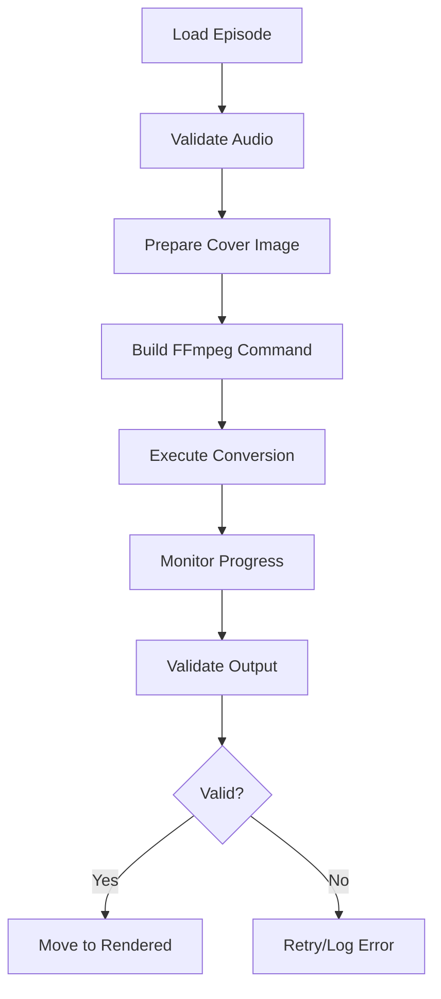

# Conversion Component Documentation

## Overview

The Conversion Component transforms audio episodes (MP3 files) into video files (MP4) suitable for YouTube upload. Each video consists of a static image displayed for the duration of the audio track, optimized for YouTube's requirements and recommendations.

## Architecture

### Core Responsibilities

1. **Audio-to-Video Conversion**: Combine static image with audio track
2. **Format Optimization**: Ensure YouTube-compatible encoding settings
3. **Batch Processing**: Handle multiple episodes efficiently
4. **Quality Control**: Validate output files meet specifications
5. **Resource Management**: Optimize CPU and memory usage during conversion

## Implementation Details

### FFmpeg Integration

The component uses FFmpeg for all media processing operations.

#### Base Command Structure
```bash
ffmpeg -loop 1 -i {image} -i {audio} -shortest \
  -c:v libx264 -c:a aac -b:a 192k \
  -pix_fmt yuv420p -vf "scale=1920:1080" \
  -preset medium -crf 23 \
  -movflags +faststart \
  {output}
```

#### Command Parameters Explained

- `-loop 1`: Loop the input image
- `-shortest`: Match video duration to audio length
- `-c:v libx264`: H.264 video codec (YouTube recommended)
- `-c:a aac`: AAC audio codec (YouTube recommended)
- `-b:a 192k`: Audio bitrate (high quality)
- `-pix_fmt yuv420p`: Pixel format for compatibility
- `-vf "scale=1920:1080"`: Full HD resolution
- `-preset medium`: Balance between speed and compression
- `-crf 23`: Constant Rate Factor for quality
- `-movflags +faststart`: Optimize for streaming

### Video Specifications

#### YouTube Recommended Settings

| Parameter | Value | Rationale |
|-----------|-------|-----------|
| Resolution | 1920x1080 (1080p) | Full HD standard |
| Frame Rate | 30 fps | Standard for static content |
| Video Codec | H.264 | Maximum compatibility |
| Audio Codec | AAC-LC | YouTube standard |
| Audio Sample Rate | 48 kHz | Professional quality |
| Audio Channels | Stereo | Preserve original |
| Container | MP4 | YouTube preferred |

### Cover Image Management

#### Image Requirements
- **Format**: JPEG or PNG
- **Resolution**: 1920x1080 pixels minimum
- **Aspect Ratio**: 16:9 (YouTube standard)
- **File Size**: Under 2MB for efficiency

#### Image Processing Pipeline
1. Load and validate source image
2. Resize/crop to exact 1920x1080
3. Apply optimizations (optional branding, episode info)
4. Cache processed image for reuse

## Key Classes and Methods

### VideoConverter

Main class for video conversion operations.

```python
class VideoConverter:
    def __init__(self, config: Config):
        """Initialize with FFmpeg settings and paths."""

    async def convert_episode(
        self,
        audio_path: Path,
        image_path: Path,
        output_path: Path
    ) -> ConversionResult:
        """Convert single audio file to video."""

    def validate_output(self, video_path: Path) -> ValidationResult:
        """Verify video meets specifications."""

    async def batch_convert(
        self,
        episodes: List[Episode],
        max_parallel: int = 2
    ) -> List[ConversionResult]:
        """Process multiple episodes concurrently."""
```

### ConversionResult

Data class for conversion outcomes.

```python
@dataclass
class ConversionResult:
    episode_id: str
    input_audio: Path
    output_video: Path
    duration: float
    file_size: int
    encoding_time: float
    success: bool
    error_message: Optional[str] = None
    ffmpeg_log: Optional[str] = None
```

### FFmpegWrapper

Low-level FFmpeg interface.

```python
class FFmpegWrapper:
    def __init__(self, ffmpeg_path: str = "ffmpeg"):
        """Initialize with FFmpeg executable path."""

    async def execute(
        self,
        command: List[str],
        timeout: Optional[int] = None
    ) -> Tuple[int, str, str]:
        """Execute FFmpeg command with timeout."""

    def probe_media(self, file_path: Path) -> MediaInfo:
        """Extract media file metadata."""

    def estimate_duration(
        self,
        file_size: int,
        bitrate: int
    ) -> float:
        """Estimate conversion time."""
```

## Processing Pipeline

### Conversion Workflow



### Batch Processing Strategy

1. **Queue Management**: Process episodes in order by date
2. **Parallel Execution**: Run 2-3 conversions simultaneously
3. **Resource Monitoring**: Track CPU and memory usage
4. **Progress Reporting**: Real-time status updates

## Error Handling

### Common Issues and Mitigations

| Issue | Detection | Mitigation |
|-------|-----------|------------|
| Corrupt audio file | FFmpeg error code | Skip and log |
| Out of disk space | Write failure | Check space before conversion |
| FFmpeg crash | Process exit code | Retry with safe mode settings |
| Invalid codec | Probe failure | Re-encode audio first |
| Memory exhaustion | System monitoring | Reduce parallel conversions |

### Recovery Mechanisms

- **Automatic Retry**: Up to 2 attempts with adjusted settings
- **Fallback Settings**: Use conservative encoding parameters
- **Partial Output Cleanup**: Remove incomplete files
- **Detailed Logging**: Capture FFmpeg stderr for debugging

## Configuration

```yaml
conversion:
  ffmpeg_path: /usr/local/bin/ffmpeg
  cover_image: ./assets/hooting-yard-cover.jpg
  output_format:
    video_codec: libx264
    audio_codec: aac
    resolution: 1920x1080
    fps: 30
    video_bitrate: 1500k
    audio_bitrate: 192k
    preset: medium
    crf: 23
  processing:
    max_parallel: 2
    timeout_minutes: 30
    temp_directory: ./temp
    cleanup_temp: true
  validation:
    check_duration: true
    check_resolution: true
    check_codecs: true
    min_file_size: 1048576  # 1MB
```

## Performance Optimization

### Speed Improvements

1. **Hardware Acceleration**: Use GPU encoding if available
2. **Preset Tuning**: Balance quality vs speed
3. **Two-Pass Encoding**: Optional for better compression
4. **RAM Disk**: Use for temporary files

### Resource Management

```python
class ResourceMonitor:
    def get_available_cores(self) -> int:
        """Determine safe number of parallel jobs."""

    def check_disk_space(self, required: int) -> bool:
        """Verify sufficient storage available."""

    def estimate_memory_usage(self, resolution: str) -> int:
        """Calculate expected RAM consumption."""
```

## Quality Assurance

### Validation Checks

1. **Duration Match**: Video length equals audio length (±1 second)
2. **Resolution Verify**: Confirm 1920x1080 output
3. **Codec Compliance**: Check H.264/AAC encoding
4. **File Integrity**: Validate container structure
5. **Playback Test**: Optional test with ffprobe

### Metrics Collection

```python
@dataclass
class ConversionMetrics:
    total_episodes: int
    successful: int
    failed: int
    total_duration: float
    total_size: int
    average_compression: float
    processing_time: float
```

## Integration Points

### Input from Retrieval Component
- MP3 audio files
- Episode metadata
- Processing priority

### Output to Upload Component
- MP4 video files
- Video metadata
- Thumbnail images (optional)

### State Management Updates
- Conversion status
- Output file paths
- Error logs

## Testing Strategy

### Unit Tests
- FFmpeg command generation
- Error handling logic
- Configuration parsing

### Integration Tests
- Sample audio conversion
- Batch processing simulation
- Resource limit testing

### Performance Tests
- Conversion speed benchmarks
- Memory usage profiling
- Parallel processing limits

## Future Enhancements

1. **Dynamic Thumbnails**: Generate episode-specific images
2. **Waveform Visualization**: Add audio waveform overlay
3. **Subtitle Integration**: Embed transcript as captions
4. **Multi-Resolution**: Generate multiple quality versions
5. **Cloud Processing**: Offload to cloud GPU instances
6. **Progress Bars**: Visual encoding progress in video
7. **Intro/Outro**: Add branded segments
8. **Chapter Markers**: Include story timestamps