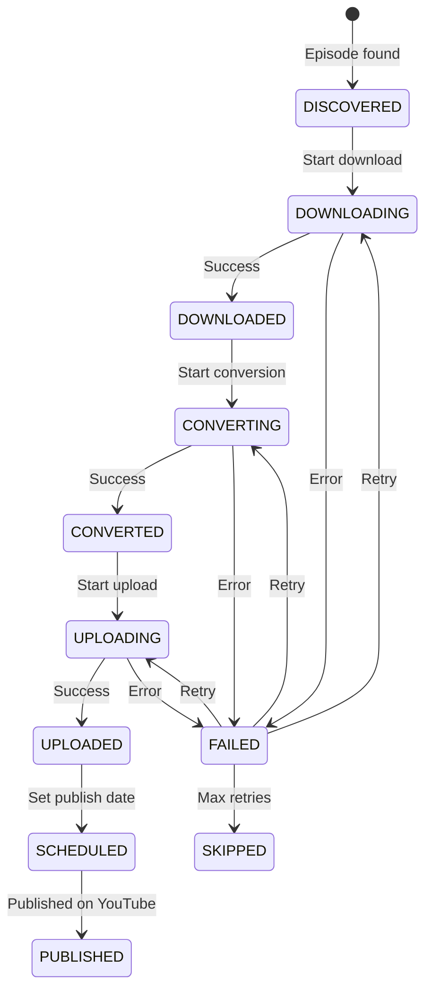

# State Management Component Documentation

## Overview

The State Management Component tracks the progress of the entire migration pipeline, ensuring idempotent operations, enabling safe resumption after interruptions, and preventing duplicate processing. It maintains a persistent record of all episodes through their journey from discovery to publication.

## Architecture

### Core Responsibilities

1. **Progress Tracking**: Monitor each episode's status through pipeline stages
2. **Resumption Support**: Enable safe restart after failures or interruptions
3. **Deduplication**: Prevent reprocessing of completed episodes
4. **Audit Trail**: Maintain complete history of all operations
5. **Reporting**: Generate progress reports and statistics

## Implementation Details

### Storage Strategy

#### Hybrid Approach

1. **YAML Files**: Individual episode state for human readability
2. **SQLite Database**: Aggregate queries and performance
3. **JSON Index**: Fast lookups and caching

### State Model

```python
from enum import Enum
from dataclasses import dataclass
from datetime import datetime
from typing import Optional, List, Dict, Any

class ProcessingStage(Enum):
    DISCOVERED = "discovered"
    DOWNLOADING = "downloading"
    DOWNLOADED = "downloaded"
    CONVERTING = "converting"
    CONVERTED = "converted"
    UPLOADING = "uploading"
    UPLOADED = "uploaded"
    SCHEDULED = "scheduled"
    PUBLISHED = "published"
    FAILED = "failed"
    SKIPPED = "skipped"

@dataclass
class EpisodeState:
    # Identification
    episode_id: str
    archive_identifier: str
    date: datetime
    title: str

    # Current Status
    stage: ProcessingStage
    status_message: str
    last_updated: datetime

    # File References
    source_url: Optional[str] = None
    audio_file: Optional[Path] = None
    video_file: Optional[Path] = None
    transcript_file: Optional[Path] = None

    # Processing Metadata
    download_attempts: int = 0
    conversion_attempts: int = 0
    upload_attempts: int = 0

    # YouTube Metadata
    youtube_video_id: Optional[str] = None
    scheduled_date: Optional[datetime] = None
    published_date: Optional[datetime] = None
    playlist_ids: List[str] = field(default_factory=list)

    # Quality Metrics
    audio_duration: Optional[float] = None
    audio_size: Optional[int] = None
    video_size: Optional[int] = None
    processing_time: Optional[float] = None

    # Error Tracking
    error_history: List[Dict[str, Any]] = field(default_factory=list)
```

### File Structure

```
processed/
├── 2004/
│   ├── hy0_hooting_yard_2004-04-14.yaml
│   ├── hy0_hooting_yard_2004-04-21.yaml
│   └── ...
├── 2005/
│   └── ...
├── index.json
├── state.db
└── reports/
    ├── daily_report_2024-09-15.html
    └── summary.json
```

## Key Classes and Methods

### StateManager

Central state coordination class.

```python
class StateManager:
    def __init__(self, state_dir: Path):
        """Initialize with state directory."""
        self.state_dir = state_dir
        self.db = self._init_database()
        self.index = self._load_index()

    def get_episode_state(self, episode_id: str) -> Optional[EpisodeState]:
        """Retrieve current state for episode."""

    def update_state(
        self,
        episode_id: str,
        stage: ProcessingStage,
        **kwargs
    ) -> None:
        """Update episode processing state."""

    def get_episodes_by_stage(
        self,
        stage: ProcessingStage
    ) -> List[EpisodeState]:
        """Find all episodes at specific stage."""

    def get_next_for_processing(
        self,
        stage: ProcessingStage,
        limit: int = 10
    ) -> List[EpisodeState]:
        """Get batch of episodes ready for next stage."""
```

### StateDatabase

SQLite backend for efficient queries.

```python
class StateDatabase:
    def __init__(self, db_path: Path):
        """Initialize SQLite database."""
        self.conn = sqlite3.connect(db_path)
        self._create_tables()

    def _create_tables(self):
        """Create database schema."""
        self.conn.execute("""
            CREATE TABLE IF NOT EXISTS episode_states (
                episode_id TEXT PRIMARY KEY,
                archive_identifier TEXT UNIQUE,
                date TEXT,
                title TEXT,
                stage TEXT,
                status_message TEXT,
                last_updated TEXT,
                youtube_video_id TEXT,
                scheduled_date TEXT,
                published_date TEXT,
                error_count INTEGER DEFAULT 0
            )
        """)

        self.conn.execute("""
            CREATE TABLE IF NOT EXISTS processing_log (
                id INTEGER PRIMARY KEY AUTOINCREMENT,
                episode_id TEXT,
                timestamp TEXT,
                stage TEXT,
                event TEXT,
                details TEXT,
                FOREIGN KEY (episode_id) REFERENCES episode_states(episode_id)
            )
        """)

    def record_event(
        self,
        episode_id: str,
        event: str,
        details: Optional[str] = None
    ):
        """Log processing event."""
```

### YAMLPersistence

Individual episode state files.

```python
class YAMLPersistence:
    @staticmethod
    def save_state(state: EpisodeState, path: Path):
        """Persist episode state to YAML."""
        data = {
            'episode_id': state.episode_id,
            'archive_identifier': state.archive_identifier,
            'date': state.date.isoformat(),
            'title': state.title,
            'stage': state.stage.value,
            'status_message': state.status_message,
            'last_updated': state.last_updated.isoformat(),
            'files': {
                'source_url': state.source_url,
                'audio_file': str(state.audio_file) if state.audio_file else None,
                'video_file': str(state.video_file) if state.video_file else None,
                'transcript_file': str(state.transcript_file) if state.transcript_file else None,
            },
            'youtube': {
                'video_id': state.youtube_video_id,
                'scheduled_date': state.scheduled_date.isoformat() if state.scheduled_date else None,
                'published_date': state.published_date.isoformat() if state.published_date else None,
                'playlist_ids': state.playlist_ids,
            },
            'metrics': {
                'audio_duration': state.audio_duration,
                'audio_size': state.audio_size,
                'video_size': state.video_size,
                'processing_time': state.processing_time,
            },
            'attempts': {
                'download': state.download_attempts,
                'conversion': state.conversion_attempts,
                'upload': state.upload_attempts,
            },
            'error_history': state.error_history,
        }

        with open(path, 'w') as f:
            yaml.dump(data, f, default_flow_style=False)
```

## State Transitions

### Processing Pipeline Flow



### Transition Rules

```python
class StateTransitionValidator:
    VALID_TRANSITIONS = {
        ProcessingStage.DISCOVERED: [ProcessingStage.DOWNLOADING, ProcessingStage.SKIPPED],
        ProcessingStage.DOWNLOADING: [ProcessingStage.DOWNLOADED, ProcessingStage.FAILED],
        ProcessingStage.DOWNLOADED: [ProcessingStage.CONVERTING, ProcessingStage.SKIPPED],
        ProcessingStage.CONVERTING: [ProcessingStage.CONVERTED, ProcessingStage.FAILED],
        ProcessingStage.CONVERTED: [ProcessingStage.UPLOADING, ProcessingStage.SKIPPED],
        ProcessingStage.UPLOADING: [ProcessingStage.UPLOADED, ProcessingStage.FAILED],
        ProcessingStage.UPLOADED: [ProcessingStage.SCHEDULED],
        ProcessingStage.SCHEDULED: [ProcessingStage.PUBLISHED],
        ProcessingStage.FAILED: [
            ProcessingStage.DOWNLOADING,
            ProcessingStage.CONVERTING,
            ProcessingStage.UPLOADING,
            ProcessingStage.SKIPPED
        ],
    }

    @classmethod
    def can_transition(
        cls,
        from_stage: ProcessingStage,
        to_stage: ProcessingStage
    ) -> bool:
        """Validate state transition."""
        return to_stage in cls.VALID_TRANSITIONS.get(from_stage, [])
```

## Recovery Mechanisms

### Resumption Logic

```python
class RecoveryManager:
    def __init__(self, state_manager: StateManager):
        self.state_manager = state_manager

    def identify_incomplete(self) -> Dict[ProcessingStage, List[str]]:
        """Find all incomplete episodes by stage."""
        incomplete = {}
        for stage in ProcessingStage:
            if stage not in [ProcessingStage.PUBLISHED, ProcessingStage.SKIPPED]:
                episodes = self.state_manager.get_episodes_by_stage(stage)
                if episodes:
                    incomplete[stage] = [e.episode_id for e in episodes]
        return incomplete

    def resume_processing(self):
        """Resume processing from last known state."""
        # Resume downloads
        downloading = self.state_manager.get_episodes_by_stage(
            ProcessingStage.DOWNLOADING
        )
        for episode in downloading:
            # Check if partial download exists
            if self._has_partial_download(episode):
                # Resume download
                pass
            else:
                # Restart download
                pass

    def cleanup_orphaned_files(self):
        """Remove files without corresponding state entries."""
```

### Error Recovery

```python
class ErrorRecovery:
    MAX_RETRIES = {
        ProcessingStage.DOWNLOADING: 3,
        ProcessingStage.CONVERTING: 2,
        ProcessingStage.UPLOADING: 3,
    }

    def should_retry(self, state: EpisodeState) -> bool:
        """Determine if episode should be retried."""
        if state.stage == ProcessingStage.DOWNLOADING:
            return state.download_attempts < self.MAX_RETRIES[state.stage]
        elif state.stage == ProcessingStage.CONVERTING:
            return state.conversion_attempts < self.MAX_RETRIES[state.stage]
        elif state.stage == ProcessingStage.UPLOADING:
            return state.upload_attempts < self.MAX_RETRIES[state.stage]
        return False

    def handle_error(
        self,
        state: EpisodeState,
        error: Exception
    ) -> ProcessingStage:
        """Determine next stage after error."""
        state.error_history.append({
            'timestamp': datetime.now().isoformat(),
            'stage': state.stage.value,
            'error': str(error),
            'traceback': traceback.format_exc()
        })

        if self.should_retry(state):
            return state.stage  # Retry same stage
        else:
            return ProcessingStage.SKIPPED  # Give up
```

## Reporting and Analytics

### Progress Reports

```python
class ReportGenerator:
    def __init__(self, state_manager: StateManager):
        self.state_manager = state_manager

    def generate_summary(self) -> Dict[str, Any]:
        """Generate overall progress summary."""
        total = self.state_manager.count_all_episodes()
        by_stage = self.state_manager.count_by_stage()

        return {
            'timestamp': datetime.now().isoformat(),
            'total_episodes': total,
            'progress': {
                'discovered': by_stage.get(ProcessingStage.DISCOVERED, 0),
                'downloaded': by_stage.get(ProcessingStage.DOWNLOADED, 0),
                'converted': by_stage.get(ProcessingStage.CONVERTED, 0),
                'uploaded': by_stage.get(ProcessingStage.UPLOADED, 0),
                'scheduled': by_stage.get(ProcessingStage.SCHEDULED, 0),
                'published': by_stage.get(ProcessingStage.PUBLISHED, 0),
                'failed': by_stage.get(ProcessingStage.FAILED, 0),
                'skipped': by_stage.get(ProcessingStage.SKIPPED, 0),
            },
            'completion_percentage': (
                by_stage.get(ProcessingStage.PUBLISHED, 0) / total * 100
            ) if total > 0 else 0,
            'estimated_completion': self._estimate_completion_date(),
        }

    def generate_html_report(self) -> str:
        """Generate detailed HTML report."""
```

## Configuration

```yaml
state_management:
  state_directory: ./processed
  database_file: state.db

  retention:
    yaml_files: true  # Keep individual YAML files
    compress_old: true  # Compress files older than 30 days

  reporting:
    generate_daily: true
    generate_weekly: true
    report_format: html  # html, json, csv

  recovery:
    auto_resume: true
    max_retries:
      download: 3
      conversion: 2
      upload: 3
    retry_delay: 300  # seconds

  monitoring:
    alert_on_failure: true
    alert_threshold: 5  # consecutive failures
    webhook_url: null  # Optional webhook for alerts
```

## Concurrent Access

### Locking Strategy

```python
class StateLock:
    def __init__(self, lock_dir: Path):
        self.lock_dir = lock_dir

    @contextmanager
    def episode_lock(self, episode_id: str):
        """Acquire exclusive lock for episode."""
        lock_file = self.lock_dir / f"{episode_id}.lock"

        # Try to create lock file
        start_time = time.time()
        while lock_file.exists():
            if time.time() - start_time > 30:
                raise TimeoutError(f"Could not acquire lock for {episode_id}")
            time.sleep(0.1)

        try:
            lock_file.touch()
            yield
        finally:
            lock_file.unlink(missing_ok=True)
```

## Testing Strategy

### Unit Tests
- State transition validation
- YAML serialization/deserialization
- Database operations
- Lock management

### Integration Tests
- Multi-process access simulation
- Recovery scenario testing
- Report generation

### Data Integrity Tests
- Consistency between YAML and database
- Orphaned file detection
- State corruption recovery

## Future Enhancements

1. **Real-time Dashboard**: Web interface for monitoring
2. **Distributed Processing**: Support multiple worker nodes
3. **Event Streaming**: Publish state changes to message queue
4. **Machine Learning**: Predict processing times and failures
5. **Backup and Restore**: Automated state backups
6. **GraphQL API**: Query interface for state data
7. **Metrics Export**: Prometheus/Grafana integration
8. **Workflow Orchestration**: Integration with Airflow/Prefect