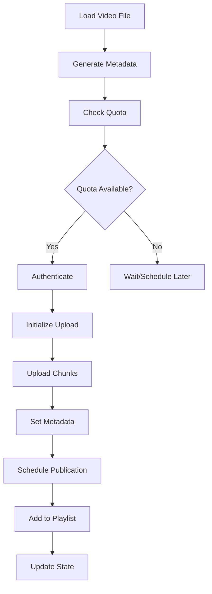

# Upload Component Documentation

## Overview

The Upload Component handles the automated upload and scheduling of converted videos to YouTube using the YouTube Data API v3. It manages authentication, metadata, scheduling, and playlist organization while respecting API quotas and rate limits.

## Architecture

### Core Responsibilities

1. **Authentication Management**: Handle OAuth 2.0 flow and token refresh
2. **Video Upload**: Transfer video files to YouTube with metadata
3. **Schedule Management**: Set publish dates for weekly releases
4. **Playlist Organization**: Create and manage video playlists
5. **Quota Management**: Track and respect API usage limits

## Implementation Details

### YouTube API Integration

#### Authentication Flow

1. **Initial Setup**: One-time OAuth consent
2. **Token Storage**: Secure credential persistence
3. **Auto-Refresh**: Handle token expiration gracefully

```python
from google.auth.transport.requests import Request
from google.oauth2.credentials import Credentials
from google_auth_oauthlib.flow import InstalledAppFlow
from googleapiclient.discovery import build

SCOPES = ['https://www.googleapis.com/auth/youtube.upload']
```

#### API Services Used

- **youtube.videos.insert**: Upload video files
- **youtube.videos.update**: Modify video metadata
- **youtube.playlists.insert**: Create playlists
- **youtube.playlistItems.insert**: Add videos to playlists

### Upload Strategy

#### Scheduling Algorithm

```python
def calculate_publish_date(
    episode_number: int,
    start_date: datetime,
    interval_days: int = 7
) -> datetime:
    """Calculate scheduled publish date for episode."""
    return start_date + timedelta(days=episode_number * interval_days)
```

#### Video Metadata Structure

```python
@dataclass
class VideoMetadata:
    title: str
    description: str
    tags: List[str]
    category_id: str = "24"  # Entertainment
    privacy_status: str = "private"
    publish_at: Optional[datetime] = None
    playlist_ids: List[str] = field(default_factory=list)

    def to_youtube_format(self) -> dict:
        """Convert to YouTube API format."""
        return {
            'snippet': {
                'title': self.title,
                'description': self.description,
                'tags': self.tags,
                'categoryId': self.category_id
            },
            'status': {
                'privacyStatus': self.privacy_status,
                'publishAt': self.publish_at.isoformat() if self.publish_at else None,
                'selfDeclaredMadeForKids': False
            }
        }
```

## Key Classes and Methods

### YouTubeUploader

Main class for YouTube operations.

```python
class YouTubeUploader:
    def __init__(self, config: Config):
        """Initialize with API credentials and settings."""
        self.youtube = self._authenticate()
        self.quota_tracker = QuotaTracker()

    def authenticate(self) -> Resource:
        """Handle OAuth 2.0 authentication flow."""

    async def upload_video(
        self,
        video_path: Path,
        metadata: VideoMetadata,
        thumbnail_path: Optional[Path] = None
    ) -> str:
        """Upload video and return YouTube video ID."""

    def schedule_video(
        self,
        video_id: str,
        publish_date: datetime
    ) -> bool:
        """Set scheduled publish date for video."""

    def create_playlist(
        self,
        title: str,
        description: str
    ) -> str:
        """Create new playlist and return ID."""
```

### QuotaTracker

Manages API quota usage.

```python
class QuotaTracker:
    # YouTube API quotas (as of 2024)
    DAILY_QUOTA = 10000
    UPLOAD_COST = 1600  # Per video
    UPDATE_COST = 50

    def __init__(self):
        self.usage = self._load_usage()

    def can_upload(self, count: int = 1) -> bool:
        """Check if uploads can proceed within quota."""
        required = count * self.UPLOAD_COST
        return self.get_remaining() >= required

    def record_upload(self):
        """Track quota usage for upload."""
        self.usage += self.UPLOAD_COST
        self._save_usage()
```

### ResumableUpload

Handles large file uploads with resume capability.

```python
class ResumableUpload:
    def __init__(
        self,
        service: Resource,
        video_path: Path,
        metadata: dict
    ):
        """Initialize resumable upload session."""

    def upload_with_retry(
        self,
        max_retries: int = 3,
        chunk_size: int = 50 * 1024 * 1024  # 50MB
    ) -> str:
        """Upload with automatic retry on failure."""

    def _resumable_upload(self) -> str:
        """Perform chunked upload with progress tracking."""
```

## Upload Workflow

### Complete Upload Process



### Metadata Generation

```python
def generate_metadata(episode: Episode) -> VideoMetadata:
    """Create YouTube metadata from episode information."""

    # Extract transcript for description
    transcript_summary = summarize_transcript(episode.transcript)

    # Build description with timestamps
    description = f"""
{episode.original_description}

Episode Date: {episode.date.strftime('%B %d, %Y')}

Stories in this episode:
{format_story_list(episode.stories)}

Transcript:
{transcript_summary}

---
Originally broadcast on Resonance FM
Archive: https://archive.org/details/{episode.identifier}
    """

    return VideoMetadata(
        title=f"Hooting Yard: {episode.title}",
        description=description,
        tags=['Hooting Yard', 'Frank Key', 'Radio', 'Spoken Word', 'Literature'],
        publish_at=calculate_publish_date(episode.number)
    )
```

## Error Handling

### Common Errors and Recovery

| Error Type | Cause | Recovery Strategy |
|------------|-------|-------------------|
| `HttpError 403` | Quota exceeded | Wait 24h, retry |
| `HttpError 401` | Auth expired | Refresh token |
| `ResumableUploadError` | Network interruption | Resume from last chunk |
| `InvalidVideoError` | Bad format | Re-convert video |
| `DuplicateVideoError` | Already uploaded | Skip, update metadata |

### Retry Logic

```python
@retry(
    stop=stop_after_attempt(3),
    wait=wait_exponential(multiplier=1, min=4, max=60),
    retry=retry_if_exception_type(HttpError)
)
async def upload_with_retry(self, video_path: Path, metadata: VideoMetadata):
    """Upload with automatic retry on transient failures."""
```

## Configuration

```yaml
upload:
  credentials_file: ./credentials/client_secret.json
  token_file: ./credentials/token.json

  channel:
    id: UC...  # YouTube channel ID

  scheduling:
    start_date: "2025-10-01T10:00:00Z"
    interval_days: 7
    time_of_day: "10:00:00"
    timezone: "Europe/London"

  metadata:
    category: "Entertainment"
    default_tags:
      - "Hooting Yard"
      - "Frank Key"
      - "Spoken Word"
    language: "en-GB"

  upload_settings:
    chunk_size: 52428800  # 50MB
    max_retries: 3
    notify_subscribers: false

  playlists:
    by_year: true
    by_series: true
    master_playlist: "All Hooting Yard Episodes"

  quota:
    daily_limit: 10000
    reserve: 1000  # Keep in reserve
    uploads_per_day: 5  # Max videos per day
```

## Playlist Management

### Organization Strategy

1. **Master Playlist**: All episodes in chronological order
2. **Year Playlists**: Episodes grouped by year (2004, 2005, etc.)
3. **Series Playlists**: Special series or themes
4. **Featured Playlist**: Editor's picks or popular episodes

```python
class PlaylistManager:
    def organize_episode(self, episode: Episode, video_id: str):
        """Add video to appropriate playlists."""

        # Add to master playlist
        self.add_to_playlist(video_id, self.master_playlist_id)

        # Add to year playlist
        year_playlist = self.get_or_create_year_playlist(episode.date.year)
        self.add_to_playlist(video_id, year_playlist)

        # Add to any series playlists
        for series in episode.series:
            series_playlist = self.get_or_create_series_playlist(series)
            self.add_to_playlist(video_id, series_playlist)
```

## Rate Limiting

### API Request Management

```python
class RateLimiter:
    def __init__(self, requests_per_second: float = 2.0):
        self.min_interval = 1.0 / requests_per_second
        self.last_request = 0

    async def wait_if_needed(self):
        """Ensure minimum time between requests."""
        elapsed = time.time() - self.last_request
        if elapsed < self.min_interval:
            await asyncio.sleep(self.min_interval - elapsed)
        self.last_request = time.time()
```

## Monitoring and Analytics

### Upload Metrics

```python
@dataclass
class UploadMetrics:
    total_uploaded: int
    successful_uploads: int
    failed_uploads: int
    total_size_gb: float
    average_upload_time: float
    quota_used: int
    scheduled_count: int
    published_count: int
```

### Progress Tracking

```python
class UploadProgress:
    def __init__(self, total_episodes: int):
        self.total = total_episodes
        self.completed = 0
        self.in_progress = None

    def update(self, episode_id: str, status: str, progress: float = 0):
        """Update upload progress for monitoring."""
        self.in_progress = {
            'episode': episode_id,
            'status': status,
            'progress': progress,
            'timestamp': datetime.now()
        }
```

## Testing Strategy

### Unit Tests
- Mock YouTube API responses
- Test metadata generation
- Validate scheduling logic

### Integration Tests
- Test with YouTube API sandbox
- Verify OAuth flow
- Test upload resumption

### End-to-End Tests
- Upload test videos to private channel
- Verify scheduling works correctly
- Test playlist management

## Security Considerations

1. **Credential Storage**: Never commit credentials to git
2. **Token Refresh**: Automatic token renewal
3. **Scope Limitation**: Request minimum necessary permissions
4. **Audit Logging**: Track all API operations

## Future Enhancements

1. **Bulk Operations**: Batch API calls for efficiency
2. **Analytics Integration**: Track video performance
3. **Comment Management**: Monitor and respond to comments
4. **Live Streaming**: Support for live episode broadcasts
5. **Thumbnail Generation**: Dynamic thumbnail creation
6. **Multi-Language Support**: Subtitles and translations
7. **A/B Testing**: Test different titles/descriptions
8. **Cross-Platform Publishing**: Extend to other platforms